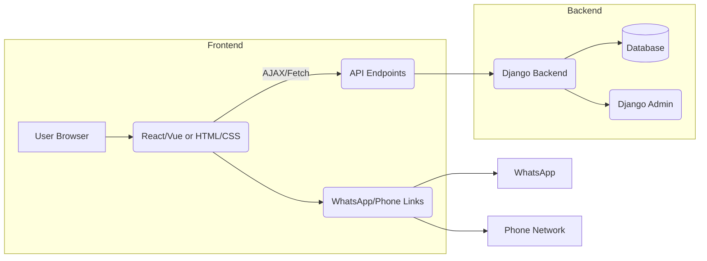
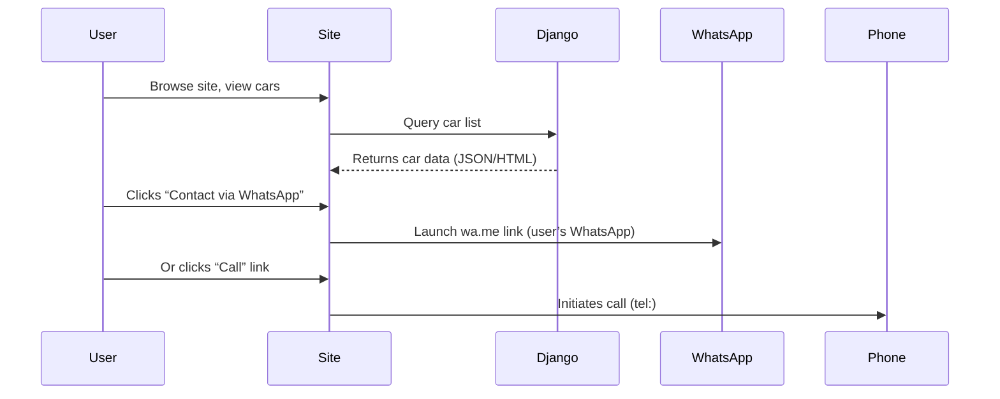

# Executive Summary  
This report analyzes Nigeria’s Abuja car market and recommends a clean, minimalist showcase website. We review Abuja dealer sites and aggregators (e.g. BuyAbujaCars, Godwin Motors【62†L48-L53】【65†L303-L310】), identifying UX/UI trends. We recommend a **Glassmorphism**-style design (frosted glass panels, subtle gradients) over Apple’s new “Liquid Glass” (which needs heavy GPU)【33†L73-L81】【30†L29-L34】. A muted neutral palette (e.g. charcoal #2C2C2C, soft white #F5F5F5, gentle gray #A2A2A2 with a warm gold accent #D4AF37 or deep blue #1F4E79) supports a mature, professional look.  We emphasize mobile-first responsive design and WCAG-compliant contrast (glassmorphism can work if text overlays use darkened tints【38†L202-L209】). For 3D effects, we suggest using **three.js** or Google’s `<model-viewer>` with optimized glTF (GLB) models【59†L112-L120】. Django is optional (used if an admin interface or data-driven inventory is needed): key models include Car (make, model, year, price, image, category, etc.), and simple endpoints (e.g. `GET /api/cars`, `GET /api/cars/<id>`).  Contact is handled via **WhatsApp click-to-chat** links (e.g. `https://wa.me/<NigeriaPhone>`【65†L303-L310】) and `tel:` links. Finally, we propose Nigeria-friendly hosting (e.g. local providers like WhoGoHost or DomainKing, or global VPS), SEO (structured data for vehicles【51†L2842-L2850】, meta tags, sitemap, GMB) and performance best practices (image compression, lazy-loading, caching, minified CSS/JS). Below we detail each area with sources, code snippets, diagrams and cost/time estimates.

## Market and Competitor Analysis  
Abuja has a mix of **brand dealers** (e.g. Toyota Abuja【27†L29-L37】, Globe Motors Nigeria【25†L34-L42】) and **marketplace sites**. For example, BuyAbujaCars.com (Abuja-specific aggregator) calls itself “the premier online marketplace” with 5,000+ vehicles【65†L303-L310】【62†L48-L53】. Local dealers like Godwin Motors, Makinde Motors, Caliphate Motors, etc., operate stand-alone sites or pages【62†L48-L53】. Major national players (Autochek, Jiji/Cheki, Cars45) also list Abuja inventory. Typical features seen: inventory listings with filters (make, year, price), showroom info, testimonials, and financing calculators. *Example URLs:* BuyAbujaCars (listing site), ToyotaAbuja (dealer), Lagos Fredaghe Autowheels (dealer)【65†L303-L310】【18†L31-L39】. These competitors generally use busy layouts, heavy images, and emphasize lots of info. **Gap:** Many sites lack a modern minimal aesthetic. This client site can stand out by focusing on a clean portfolio of cars (no online payment) and streamlined contact options.

## UI Pattern Recommendation (Glassmorphism vs Liquid Glass)  
**Glassmorphism** is a trending UI style using translucent panels with blur (a frosted-glass effect)【30†L29-L34】. It creates depth and a premium feel without heavy shadows. Apple’s new *“Liquid Glass”* (used in VisionOS/iOS 26) adds dynamic light reactions and reflections【33†L73-L81】, but it requires WebGPU/GPU and complex rendering, and isn’t widely supported in web today. DesignMonks recommends: *“Choose Glassmorphism when your team needs fast delivery, broad device support, and a clean, modern aesthetic without heavy GPU costs”*【35†L574-L583】. By contrast, Liquid Glass is “built for the next generation of spatial and immersive products”【35†L668-L676】, which doesn’t match a typical car showcase.

**Pros of Glassmorphism:** easy to implement with CSS (`backdrop-filter: blur()`), works on all devices, proven in major OS (macOS, Windows)【30†L29-L34】; feels modern and airy. **Cons:** text contrast can suffer on busy backgrounds【33†L73-L81】【38†L202-L209】. **Recommendation:** Use **Glassmorphism** with moderate blur (10–20px)【30†L106-L114】. Ensure sufficient overlay opacity (e.g. white at ~20-30% alpha) to keep text legible【30†L118-L122】【38†L202-L209】. Limit motion; skip heavy dynamic reflections (Liquid Glass) to ensure performance. 

**Comparison Table:** 

| Factor          | Glassmorphism            | Liquid Glass              |
|-----------------|--------------------------|---------------------------|
| Implementation  | Pure CSS (backdrop-filter), simple  | Requires WebGPU / canvas |
| Performance     | Light (uses GPU blur shader) | Heavy (real-time rendering) |
| Realism/Depth   | Medium (frosted look)     | High (light interplay, refraction) |
| Accessibility   | Moderate (work with overlays)【33†L73-L81】 | Harder (dynamic contrast issues) |
| Best Use        | Everyday product sites, dashboards【35†L572-L581】 | Immersive AR/spatial UIs (Apple) |
| Visual Result   | Matte blur panels, soft borders | Shiny, dynamic glass surfaces |

**Color Palette:** Glassmorphism calls for **soft, muted tones**【38†L144-L153】. We suggest a neutral, minimal scheme: e.g.  
- Background: dark charcoal `#2C2C2C` (or deep navy `#1F2A44`) for a premium look.  
- Panels: translucent white `rgba(255,255,255,0.15)` with blur.  
- Text/icons: light gray `#E5E5E5` or white on dark panels, and dark gray `#333333` on light panels, ensuring WCAG contrast【38†L202-L209】.  
- Accent (optional): warm gold `#D4AF37` or teal `#1F4E79` for call-to-action buttons or highlights.  

These choices yield a **mature, minimalist** vibe (no neon/brights). For instance, a hero section might use a blurred cityscape photo tinted with the background color. Overlaid UI panels (search boxes, car feature cards) use the glass effect. Keep decorative gradients subtle (e.g. a gentle linear fade or radial behind blur areas)【38†L178-L186】.

## Accessibility and Responsive Design  
The site must be fully responsive (mobile/tablet first) and **WCAG-compliant**. Nigeria has high mobile usage, so use flexible layouts (CSS Flex/Grid, media queries) and large tap targets for buttons/links. Key guidelines: 

- **Contrast:** Ensure text over blurred panels has ≥4.5:1 contrast. In practice, apply a semi-opaque overlay (white or dark) under text to boost contrast【38†L202-L209】. For example, blur panel has `background: rgba(255,255,255,0.2)` plus backdrop-filter, with text in dark gray.  
- **Text Size:** Use at least 16px font base; allow zoom.  
- **Alt Text:** Every image (car photo or decorative) needs meaningful `alt` text.  
- **Semantic HTML:** Use headings (`<h1>…`) for hierarchy, `<nav>` for menus, `<button>` elements for actions.  
- **ARIA & Keyboard:** Ensure navigation and the WhatsApp/chat link work by keyboard (tab focus, `aria-label` on icons).  
- **Language:** Set `lang="en"` on `<html>`.  
- **Performance Consideration:** Test on 3G/4G (Nigeria has varying mobile speeds【41†L0-L4】). Use responsive images (`` or `<picture>`), limit heavy JS.  

Following [W3C Accessibility Guidelines](https://www.w3.org/WAI/standards-guidelines/wcag) and responsive design best practices (mobile viewport, no horizontal scroll) will ensure wide accessibility.

## 3D Elements and Effects  
To add visual interest, lightweight 3D models of cars or interactive graphics can be used. We recommend the following techniques:

- **three.js:** A popular WebGL library. You can load glTF (GLB) 3D models into the scene. For example:  
  ```html
  <!-- Three.js canvas -->
  <canvas id="carCanvas"></canvas>
  <script type="module">
    import * as THREE from 'https://unpkg.com/three@0.158.0/build/three.module.js';
    import { GLTFLoader } from 'https://unpkg.com/three@0.158.0/examples/jsm/loaders/GLTFLoader.js';
    const scene = new THREE.Scene(), camera = new THREE.PerspectiveCamera(35, 1.5, 0.1, 1000);
    const renderer = new THREE.WebGLRenderer({canvas: document.getElementById('carCanvas'), alpha: true});
    // (Set renderer size, camera position, light, etc.)
    const loader = new GLTFLoader();
    loader.load('path/to/car-model.glb', gltf => {
      scene.add(gltf.scene);
      renderer.render(scene, camera);
    });
  </script>
  ```
  Compress models with **glTF**+**DRACO**: Khronos notes glTF “minimizes the size of 3D assets and runtime processing”【59†L112-L120】. Tools like `gltf-pipeline` or Blender can export `.glb`. Use **KHR_draco_mesh_compression** for geometry; use **KTX2/ETC1S/UASTC** for textures (to reduce download size).  
- **<model-viewer>:** For simpler integration, Google’s `<model-viewer>` web component can display GLB models with built-in controls:
  ```html
  <script type="module" src="https://unpkg.com/@google/model-viewer/dist/model-viewer.min.js"></script>
  <model-viewer src="car.glb" alt="3D car model" camera-controls auto-rotate 
     style="width:400px; height:300px;">
  </model-viewer>
  ```
  This requires no WebGL code and even supports AR viewing on mobile.  
- **Performance Tips:** Keep poly count low (target <100k triangles for mobile). Use Level-of-Detail (LOD): lower-res model when zoomed out. Lazy-load 3D content only when in view【53†L41-L49】【53†L110-L114】 (e.g. IntersectionObserver). Dispose of Three.js resources when done to free GPU【53†L59-L64】. Disable shadows or use at most 1-2 lights for each scene【53†L75-L81】. In CSS, ensure the 3D canvas is `pointer-events: none;` if you don’t need interaction, so it doesn’t block scrolling.  

Overall, one small 3D car preview on the homepage (maybe rotating slowly) can impress users, but avoid full 360° config tools which are heavy.  

## Django Backend (Scope, Models, API)  
If the site owner needs dynamic content (e.g. manage inventory) or a contact log, Django can be used. Otherwise a static site or headless CMS could suffice. For Django:

- **Data Models:** A basic app (e.g. `cars`) with models like:  
  ```python
  class Car(models.Model):
      MAKE_CHOICES = [...]; YEAR_CHOICES = ...
      make = models.CharField(choices=MAKE_CHOICES, max_length=50)
      model = models.CharField(max_length=100)
      year = models.IntegerField(choices=YEAR_CHOICES)
      price = models.DecimalField(max_digits=12, decimal_places=2)
      description = models.TextField(blank=True)
      image = models.ImageField(upload_to='cars/')  # or multiple images table
      is_new = models.BooleanField(default=False)
      # Additional fields: mileage, transmission, fuel, color, etc.
  ```
  An optional `ContactInquiry` model could store inquiries (name, email, message, timestamp) if one wants to log, even though contact is via WhatsApp/call.  
- **Admin Interface:** Use Django Admin for dealers to add/edit cars and content pages (About, FAQ, etc.) without coding.  
- **API Endpoints:** With Django REST Framework (DRF), expose read-only endpoints for listing cars (if needed for a SPA or AJAX). Example endpoints:  
  - `GET /api/cars/` – list all cars (with filters).  
  - `GET /api/cars/<id>/` – retrieve details of one car.  
  - (No POST/PUT needed unless enabling remote edits; updates done via Admin.)  
  - Optionally, `GET /api/makes/`, `GET /api/models/` for dropdown data.  
- **Authentication:** Not needed for public browsing (no login). Only the admin/dealer needs an account to manage. Use Django’s built-in user system for admin, optionally a simple login page. If future e-commerce was intended (not here), you’d add user auth and permissions, but for showcase site, skip it.  
- **Integration:** The frontend can fetch JSON from these endpoints if using AJAX/React; or Django templates can render the car list server-side. Given no online payments, server load is minimal.  
- **Mermaid – Architecture & Data Flow:**  


*Figure: Simplified architecture.*  


*Figure: Data flow for content fetch and user contact.*  

## WhatsApp/Call Contact Integration  
Since no online purchase is needed, the **contact CTA** is via WhatsApp chat or phone call. Implementation options:

- **Click-to-Chat Link:** Use WhatsApp’s universal link format:  
  ```html
  <a href="https://wa.me/2348012345678?text=I%20am%20interested%20in%20the%20Car%20XYZ" 
     target="_blank" rel="noopener">
     Chat on WhatsApp
  </a>
  ```
  This uses the Nigerian country code (234). The `text=` parameter can pre-fill a message (URL-encoded).  
- **Call Link:**  
  ```html
  <a href="tel:+2348012345678">
     Call us
  </a>
  ```
- **WhatsApp Business API (Optional):** For more automated workflows, one could register for the official WhatsApp Business API (via Facebook Business) or use a service like Twilio or WATI. That allows sending templated messages or managing chats via a bot. For a simple site, it’s sufficient to use the click-to-chat link (no coding needed). Just ensure the dealer’s WhatsApp Business profile is set up.  
- **QR Code:** For showroom use, a printed WhatsApp QR code can be generated (but out of scope for web).  
- **Snippet:** A simple HTML snippet (as above) covers both chat and call links, styled as buttons. Ensure the WhatsApp link opens in a new tab (`target="_blank"`).  

## SEO and Performance Optimization Checklist  
To maximize visibility, follow these SEO and perf best practices:

- **Meta Tags:** Unique `<title>` and `<meta name="description">` on each page, including keywords like “Cars for Sale in Abuja”, “Abuja Car Dealership”. Use `og:title`, `og:description`, and `og:image` for rich previews on social.  
- **Structured Data:** Implement Google’s Vehicle structured data on each car detail page【51†L2842-L2850】. Google now supports a “vehicle listing” schema (announced Oct 2023) which can make your inventory appear in search with price and features【51†L2842-L2850】. Use JSON-LD per [Google guidelines](https://developers.google.com/search/docs/appearance/structured-data/vehicle) (Document a subset of `schema.org/Vehicle` fields like `name`, `brand`, `modelDate`, `color`, `vehicleEngine`, `price`, `offers.availableAtOrFrom`).  
- **Sitemaps & Robots:** Generate an XML sitemap including car pages and images; submit to Google Search Console. Use `robots.txt` to allow crawling of all public sections.  
- **Local SEO:** Create/claim a Google Business Profile (formerly GMB) with showroom address in Abuja. List on local directories (Yellow Pages Nigeria, etc.). Encourage customers to leave reviews (appears in search snippet).  
- **Page Speed:** As a priority, compress all images (use WebP where possible) and minify JS/CSS. Serve scaled images (e.g. thumbnails at smaller resolutions). Leverage browser caching (proper HTTP headers). Lazy-load below-the-fold images and 3D models【53†L110-L114】. Use a CDN (Cloudflare or a Nigerian data center like Cloudflare Colocation in Lagos) to speed global/Nigerian access. Check Google PageSpeed Insights and aim for 90+ scores (mobile).  
- **Responsive Design:** Ensure no CLS (layout shifts). Use `srcset` for images and specify width/height. Use `<meta name="viewport" content="width=device-width, initial-scale=1">`.  
- **Minimize JS:** Avoid heavy frameworks if not needed. Keep DOM size reasonable.  
- **Performance Monitoring:** Use Google Analytics or similar (ethical/legal per Nigerian data laws) to track site performance.  

In summary, the site should load quickly (ideally under 3 seconds on 4G) and pass SEO technical audits. The vehicle schema is especially recommended for a car inventory site【51†L2842-L2850】.

## Technology Stack & File Structure  
A clean stack might include: **Frontend:** HTML5, CSS3 (possibly a utility framework like TailwindCSS for speed), vanilla JS or minimal React/Vue if interactivity is needed. For 3D, include three.js or `<model-viewer>`. **Backend (if used):** Python 3, Django 4.x, Django REST Framework, PostgreSQL or SQLite. Deployment could use Gunicorn + Nginx.  

Example file structure:
```
/project-root
├─ manage.py
├─ requirements.txt
├─ /project_name
│   ├─ settings.py, urls.py, wsgi.py
├─ /cars_app
│   ├─ models.py, views.py, serializers.py
│   ├─ urls.py
│   └─ templates/cars/... (Django templates)
├─ /static
│   ├─ css/styles.css
│   ├─ js/main.js (includes three.js or model-viewer scripts)
│   └─ images/ (car photos, icons)
├─ /templates
│   ├─ base.html, home.html, car_list.html, car_detail.html
└─ /media
    └─ cars/ (uploaded car images)
```
- **CSS/Design:** Use a single stylesheet or Tailwind config. Glassmorphic panels can be done with CSS like:  
  ```css
  .glass-panel {
    background: rgba(255,255,255,0.2);
    backdrop-filter: blur(15px);
    border: 1px solid rgba(255,255,255,0.3);
  }
  ```
- **JS:** Keep script libraries via CDN or build minimized bundles. Example to initialize model-viewer (if used).
- **Mermaid Architecture:** (Embedded above in Backend section.)
  
## Hosting and Deployment  
**Nigeria-Friendly Providers:** Local companies (WhoGoHost, DomainKing) offer .ng domains and shared/PHP hosting, but they often **lack Python support**. For Django, popular choices are:  
- **DigitalOcean/Vultr:** Global VPS (~$5-10/mo) with Ubuntu; fast and cost-effective.  
- **Linode/OVHcloud:** Similar VPS providers (cheaper plans).  
- **Heroku/AWS:** Heroku can host small Django apps (Hobby dynos), but requires workarounds for static/media. AWS or Google Cloud have no Nigerian region, but at least AWS has more latency; however, Cloudflare CDN mitigates this.  
- **Local Data Centers:** Nigerian data centers (Rack Centre Lagos, MainOne) exist, but DIY deployment there is more complex.  
- **SSL Certificate:** Use Let’s Encrypt (free) or buy SSL from a local registrar. .NG domains often cost ₦10,000–₦20,000/year【54†L10-L13】.  

For Nigeria targeting, register a .com.ng or .ng domain to boost local trust. Many clients pay in Naira, so choose providers that allow local card or transfer payments. WhoGoHost and DomainKing allow Naira payments, but check their Python support. Another option: use Cloudflare for DNS and SSL, and host on a global VPS; users will still get low latency via Cloudflare’s Lagos POP.

**Deployment Flow:** Use Git for version control. Set up CI/CD (GitHub Actions or GitLab CI) to auto-deploy on push (e.g. to DigitalOcean App Platform or a Droplet via SSH). Containerization (Docker) is optional but can simplify local dev vs prod parity.

## WhatsApp & Call Integration Methods  
- **Click-to-Chat:** Provide buttons linking to `https://wa.me/2348XXXXXXXX` (plus optional `?text=`). See official docs: “Use https://wa.me/<number>… in international format”【65†L303-L310】. Place this in the header/footer or each car page (“Inquire on WhatsApp”).  
- **Tel Link:** As above, use `href="tel:+2348XXXXXXXX"`. Some mobile browsers will show a “Call” dialog.  
- **WhatsApp API (Advanced):** If volume grows, one could use WhatsApp Cloud API via Meta (requires app setup) to automate greeting messages. But initially, the simple link is sufficient.  

Ensure phone numbers are clickable on desktop (some WhatsApp Desktop or Skype could handle it). For accessibility, include `aria-label="Chat on WhatsApp"`. You could also embed a **WhatsApp chat widget** script from services (e.g. WhatsHelp/WAQI) that floats on mobile view.

## SEO and Performance Checklist  
- **Search Optimization:** Use keyword-rich titles (e.g. “Buy Toyota Highlander in Abuja | [ClientName]”), add `<h1>` on home and car pages. Include local terms like “Abuja” and Nigerian currency (₦). Implement `schema.org/LocalBusiness` on contact page for address.  
- **Performance:** Preload critical assets (e.g. `rel="preload"` for fonts or hero images). Use HTTP/2 server. Gzip/ Brotli compress HTML/CSS/JS.  
- **Auditing:** Run Lighthouse or web.dev tools. Score ≥90 for performance and accessibility.  
- **Monitoring:** After launch, use Search Console for indexing, and perhaps UptimeRobot or an uptime monitor to ensure the site is live (especially if hosted on small VPS).

## Estimated Timeline & Costs

| Scope       | Timeline (approx.) | Cost Estimate (USD) |
|-------------|--------------------|---------------------|
| **Basic** – Template-based static site (no backend, minimal interactivity). Includes homepage, inventory listing (manual), contact links, blog page.  | 2–4 weeks | $500 – $1,000 |
| **Moderate** – Custom design, Django backend for inventory, basic admin. Simple 3D element. Mobile-responsive, SEO basics.  | 6–8 weeks | $1,500 – $3,000 |
| **Full Featured** – Advanced custom UI (glass effects, animations), multiple languages, full Django REST API, multiple images per car, rich metadata, 3D configurator, extensive QA.  | 10–14 weeks | $3,000 – $6,000+ |

*Notes:* These are ballpark figures. Lower cost assumes using an existing template and minimal dev; higher cost covers custom coding, testing, revisions, project management. Currency conversion: many Nigerian agencies price in NGN; for reference, ₦1,500,000–₦2,500,000 (~$2,000–$4,000) is common for a medium business site. **Open Items:** Final scope (e.g. blog, number of cars, languages) and budget will refine the timeline and cost. 

**Sources:** Official design references【30†L29-L34】【33†L73-L81】, local industry data【62†L48-L53】【65†L303-L310】, Google’s documentation【51†L2842-L2850】 and UX guidelines【38†L144-L153】【59†L112-L120】 informed these recommendations.